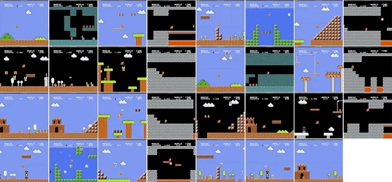
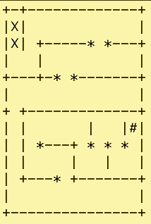
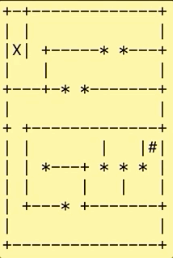
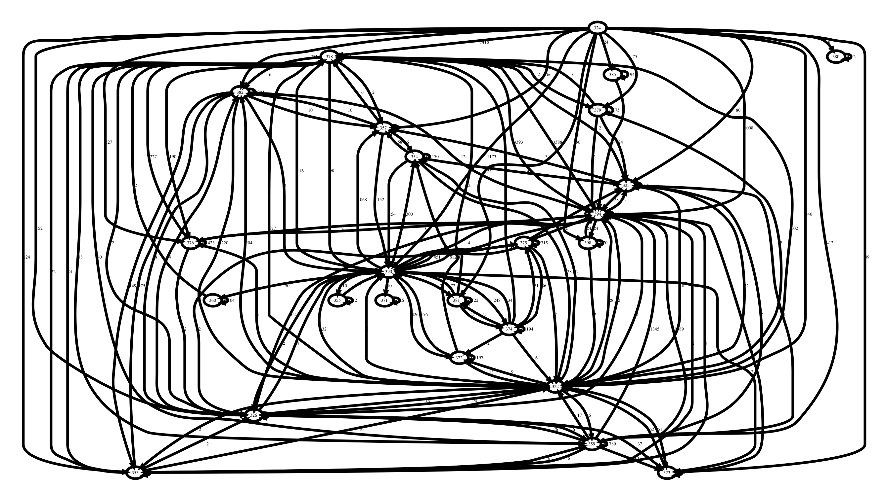

#   IJON Dataset

## Super Mario Bros.

**<a href="SHOW_ALL.md">Show All</a> (Warning: 500MB)**

| Level   |Plot                              | IJON      | 
|---------|----------------------------------|------------------|
| **1-1** |<a href="img/plot_0.svg">Plot</a> |   **✓** <a href="data/mario/gif/1-1.gif">GIF</a> <a href="data/mario/mp4/1-1.mp4">MP4</a>  |
| **1-2** |<a href="img/plot_2.svg">Plot</a> | **✓**<a href="data/mario/gif/1-2.gif">GIF</a> <a href="data/mario/mp4/1-2.mp4">MP4</a>   |
| **1-3** |<a href="img/plot_3.svg">Plot</a> |  **✓** <a href="data/mario/gif/1-3.gif">GIF</a> <a href="data/mario/mp4/1-3.mp4">MP4</a>   |
| **1-4** |<a href="img/plot_4.svg">Plot</a> | **✓** <a href="data/mario/gif/1-4.gif">GIF</a> <a href="data/mario/mp4/1-4.mp4">MP4</a>   |
|         |                                  |            |                  |       |
| **2-1** |<a href="img/plot_5.svg">Plot</a> |   **✘** <a href="data/mario/gif/2-1.gif">GIF</a> <a href="data/mario/mp4/2-1.mp4">MP4</a>   |
| **2-2** |<a href="img/plot_7.svg">Plot</a> | **✓** <a href="data/mario/gif/2-2.gif">GIF</a> <a href="data/mario/mp4/2-2.mp4">MP4</a>   |
| **2-3** |<a href="img/plot_8.svg">Plot</a> | **✓** <a href="data/mario/gif/2-3.gif">GIF</a> <a href="data/mario/mp4/2-3.mp4">MP4</a>   |
| **2-4** |<a href="img/plot_9.svg">Plot</a> | **✓** <a href="data/mario/gif/2-4.gif">GIF</a> <a href="data/mario/mp4/2-4.mp4">MP4</a>   |
|         |                                  |            |                  |       |
| **3-1** |<a href="img/plot_10.svg">Plot</a>| **✓** <a href="data/mario/gif/3-1.gif">GIF</a> <a href="data/mario/mp4/3-1.mp4">MP4</a>   |
| **3-2** |<a href="img/plot_11.svg">Plot</a>|  **✓**  <a href="data/mario/gif/3-2.gif">GIF</a> <a href="data/mario/mp4/3-2.mp4">MP4</a>   |
| **3-3** |<a href="img/plot_12.svg">Plot</a>| **✓**  <a href="data/mario/gif/3-3.gif">GIF</a> <a href="data/mario/mp4/3-4.mp4">MP4</a>   |
| **3-4** |<a href="img/plot_13.svg">Plot</a>|  **✓**  <a href="data/mario/gif/3-4.gif">GIF</a> <a href="data/mario/mp4/3-4.mp4">MP4</a>   |
|         |                                  |            |                  |       |
| **4-1** |<a href="img/plot_14.svg">Plot</a>|  **✓**  <a href="data/mario/gif/4-1.gif">GIF</a> <a href="data/mario/mp4/4-1.mp4">MP4</a>   |
| **4-2** |<a href="img/plot_16.svg">Plot</a>|  **✓** <a href="data/mario/gif/4-2.gif">GIF</a> <a href="data/mario/mp4/4-2.mp4">MP4</a>   |
| **4-3** |<a href="img/plot_17.svg">Plot</a>|  **✓** <a href="data/mario/gif/4-3.gif">GIF</a> <a href="data/mario/mp4/4-3.mp4">MP4</a>   |
| **4-4** |<a href="img/plot_18.svg">Plot</a>|  **✘** <a href="data/mario/gif/4-4.gif">GIF</a> <a href="data/mario/mp4/4-4.mp4">MP4</a>   |
|         |                                  |            |                  |       |
| **5-1** |<a href="img/plot_19.svg">Plot</a>|  **✓**  <a href="data/mario/gif/5-1.gif">GIF</a> <a href="data/mario/mp4/5-1.mp4">MP4</a>   |
| **5-2** |<a href="img/plot_20.svg">Plot</a>| **✓**  <a href="data/mario/gif/5-2.gif">GIF</a> <a href="data/mario/mp4/5-2.mp4">MP4</a>   |
| **5-3** |<a href="img/plot_21.svg">Plot</a>|  **✓**  <a href="data/mario/gif/5-3.gif">GIF</a> <a href="data/mario/mp4/5-3.mp4">MP4</a>   |
| **5-4** |<a href="img/plot_22.svg">Plot</a>|  **✓**  <a href="data/mario/gif/5-4.gif">GIF</a> <a href="data/mario/mp4/5-4.mp4">MP4</a>   |
|         |                                  |            |                  |       |
| **6-1** |<a href="img/plot_23.svg">Plot</a>|   **✓**  <a href="data/mario/gif/6-1.gif">GIF</a> <a href="data/mario/mp4/6-1.mp4">MP4</a>   |
| **6-2** |<a href="img/plot_24.svg">Plot</a>|  **✘** <a href="data/mario/gif/6-2.gif">GIF</a> <a href="data/mario/mp4/6-2.mp4">MP4</a>   |
| **6-3** |<a href="img/plot_25.svg">Plot</a>|   **✓**  <a href="data/mario/gif/6-3.gif">GIF</a> <a href="data/mario/mp4/6-3.mp4">MP4</a>   |
| **6-4** |<a href="img/plot_26.svg">Plot</a>|   **✓**  <a href="data/mario/gif/6-4.gif">GIF</a> <a href="data/mario/mp4/6-4.mp4">MP4</a>   |
|         |                                  |            |                  |       |
| **7-1** |<a href="img/plot_27.svg">Plot</a>|   **✓**  <a href="data/mario/gif/7-1.gif">GIF</a> <a href="data/mario/mp4/7-1.mp4">MP4</a>   |
| **7-2** |<a href="img/plot_29.svg">Plot</a>| **✓**  <a href="data/mario/gif/7-2.gif">GIF</a> <a href="data/mario/mp4/7-2.mp4">MP4</a>   |
| **7-3** |<a href="img/plot_30.svg">Plot</a>| **✓**  <a href="data/mario/gif/7-3.gif">GIF</a> <a href="data/mario/mp4/7-3.mp4">MP4</a>   |
| **7-4** |<a href="img/plot_31.svg">Plot</a>| **✓**  <a href="data/mario/gif/7-4.gif">GIF</a> <a href="data/mario/mp4/7-4.mp4">MP4</a>   |
|         |                                  |            |                  |       |
| **8-1** |<a href="img/plot_32.svg">Plot</a> |   **✓**  <a href="data/mario/gif/8-1.gif">GIF</a> <a href="data/mario/mp4/8-1.mp4">MP4</a>   |
| **8-2** |<a href="img/plot_33.svg">Plot</a> |   **✓** <a href="data/mario/gif/8-2.gif">GIF</a> <a href="data/mario/mp4/8-2.mp4">MP4</a>   |
| **8-3** |<a href="img/plot_34.svg">Plot</a>|   **✓** <a href="data/mario/gif/8-3.gif">GIF</a> <a href="data/mario/mp4/8-3.mp4">MP4</a>   |
| **8-4** | - | - |

## KLEE Maze 

|   |   |
|-----------------|---|
| Large Maze (**Easy**) | Large Maze (**Hard**) |

| Tool | **Small** (*Easy*) | **Small** (*Hard*) | **Large** (*Easy*) | **Large** (*Hard*)  |
|-------------------------|---|---|---|---|
| AFL (**Plain**)         | 42.7 ± 11.9  |  **✘**  | **✘**  |  **✘** |
| AFL-Fast (**Plain**)    | **✘**  | **✘** | **✘**  |  **✘** |
| AFL-lafintel (**Plain**)| **✘**  | **✘**  | **✘**  | **✘**  |   
| QSYM (**Plain**)        | 50.7 ± 0.0  | **✘**  | **✘**  | **✘**  |
| Angora (**Plain**)      | **✘**  | **✘**  | **✘**  | **✘**  | 
| KLEE (**Plain**)        | 0.7 ± 0.5   | 2.0 ± 0.0   | **✘**  | **✘**  |
|                         |   |   |   |   |
| AFL (**IJON**)         | 1.8 ± 1.0  | 7.6 ± 3.3    | 0.5 ± 0.2  | 2.3 ± 1.2   |
| AFL-Fast (**IJON**)    | 1.6 ± 0.5  | 8.4 ± 1.5    | 0.5 ± 0.1  | 5.7 ± 2.4  |
| AFL-lafintel (**IJON**)| 2.3 ± 0.9  | 7.6 ± 1.5    | 0.7 ± 0.3  | 3.4 ± 2.3  |   
| QSYM (**IJON**)        | 5.4 ± 1.6  | 11.4 ± 1.4   | 5.3 ± 0.1  | 11.3 ± 0.6  |
| Angora (**IJON**)      | 42.4 ± 0.0  | 36.5 ± 0.3  | 7.5 ± 0.2  | 15.9 ± 3.8  | 

## TPM

|   |   |
|-----------------|---|
| AFL | AFL-IJON |

