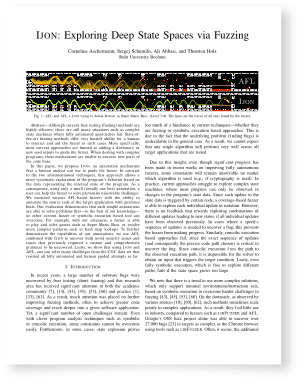

IJON SPACE EXPLORER
======

<p>
<a href="https://www.syssec.ruhr-uni-bochum.de/media/emma/veroeffentlichungen/2020/02/27/IJON-Oakland20.pdf"> </a>

IJON is an annotation mechanism that analysts can use to guide fuzzers such as AFL. Using only a small (usually one line) annotation, one can help the fuzzer solve previously unsolvable challenges. For example, with this extension, a fuzzer is able to play and solve games such as Super Mario Bros. or resolve more complex patterns such as hash map lookups.

</p>


More data and the results of the experiments can be found 
<a href="https://github.com/RUB-SysSec/ijon-data/tree/master/ijon-data">here:<br>


</a>

## Compile AFL+IJON

after compiling AFL as usually, run:

```
cd llvm_mode
LLVM_CONFIG=llvm-config-6.0 CC=clang-6.0 make
```

## Annotations

When using  `afl-clang-fast`with Ijon, you can use the following annotations & helper functions in you program to guide AFL.

```
void ijon_xor_state(ijon_u32_t);
void ijon_push_state(ijon_u32_t);

void ijon_map_inc(ijon_u32_t);
void ijon_map_set(ijon_u32_t);

ijon_u32_t ijon_strdist(char* a,char* b);
ijon_u32_t ijon_memdist(char* a,char* b, ijon_size_t len);

void ijon_max(ijon_u32_t addr, ijon_u64_t val);

void ijon_min(ijon_u32_t addr, ijon_u64_t val);

ijon_u64_t ijon_simple_hash(ijon_u64_t val);
ijon_u32_t ijon_hashint(ijon_u32_t old, ijon_u32_t val);
ijon_u32_t ijon_hashstr(ijon_u32_t old, char* val);
ijon_u32_t ijon_hashmem(ijon_u32_t old, char* val, ijon_size_t len);

uint32_t ijon_hashstack(); //warning, can be flaky as stackunwinding is nontrivial

void ijon_enable_feedback();
void ijon_disable_feedback();

#define _IJON_CONCAT(x, y) x##y
#define _IJON_UNIQ_NAME() IJON_CONCAT(temp,__LINE__)
#define _IJON_ABS_DIST(x,y) ((x)<(y) ? (y)-(x) : (x)-(y))

#define IJON_BITS(x) ((x==0)?{0}:__builtin_clz(x))
#define IJON_INC(x) ijon_map_inc(ijon_hashstr(__LINE__,__FILE__)^(x))
#define IJON_SET(x) ijon_map_set(ijon_hashstr(__LINE__,__FILE__)^(x))

#define IJON_CTX(x) ({ uint32_t hash = hashstr(__LINE__,__FILE__); ijon_xor_state(hash); __typeof__(x) IJON_UNIQ_NAME() = (x); ijon_xor_state(hash); IJON_UNIQ_NAME(); })

#define IJON_MAX(x) ijon_max(ijon_hashstr(__LINE__,__FILE__),(x))
#define IJON_MIN(x) ijon_max(ijon_hashstr(__LINE__,__FILE__),0xffffffffffffffff-(x))
#define IJON_CMP(x,y) IJON_INC(__builtin_popcount((x)^(y)))
#define IJON_DIST(x,y) ijon_min(ijon_hashstr(__LINE__,__FILE__), _IJON_ABS_DIST(x,y))
#define IJON_STRDIST(x,y) IJON_SET(ijon_hashint(ijon_hashstack(), ijon_strdist(x,y)))
```

## TIPS on using IJON

You typically want to run AFL with IJON extension in slave mode with multiple other fuzzer instances. If IJON solved the challenging structure, the other fuzzers will pick up the resulting inputs, while ignoring the intermediate queue entries that IJON produced.   

If you make extensive use of the `IJON_MIN` or `IJON_MAX` primitives, you might want to disable normal instrumentation using  `AFL_INST_RATIO=1 make`. 

If, for some reason you want to use the version exactly from the paper (even though it contains known bugs), please use this [commit](https://github.com/RUB-SysSec/ijon/tree/a66bc074598bf81f836c777d15e25060d3ef091b)
